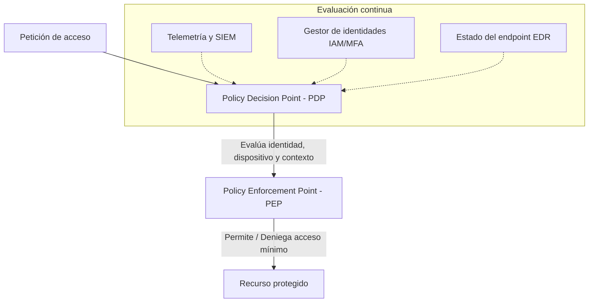

# Zero Trust (confianza cero)

  

    Categoría
    Arquitectura y seguridad en redes
  

  

    Estándar
    NIST SP 800-207
  

  

    Autor / Colaborador
    <a href="https://github.com/cibercelia" target="_blank">@cibercelia</a>
  

## 📖 Definición

**Zero Trust** (confianza cero) es una filosofía y modelo estratégico de seguridad integral que asume que las amenazas existen tanto fuera como dentro del perímetro tradicional de la red. Bajo el paradigma de **«Nunca confiar, siempre verificar»** (*Never Trust, Always Verify*), ningún usuario, dispositivo, servicio o flujo de red se considera confiable por defecto, independientemente de su ubicación física o de red corporativa.

!!! warning "Importante"
    Zero Trust no es un producto o herramienta concreta que se compra, sino una arquitectura y marco de trabajo continuo que combina identidades robustas, microsegmentación, observabilidad y políticas dinámicas basadas en contexto.

---

## ⚙️ ¿Cómo funciona? / Principios fundamentales (NIST SP 800-207)

1. **Verificar explícitamente**: autenticar y autorizar siempre en función de todos los puntos de datos disponibles (identidad del usuario, ubicación, estado de salud del dispositivo, servicio solicitado y anomalías de comportamiento).
2. **Uso del acceso de mínimo privilegio (PoLP)**: limitar el acceso de los usuarios mediante acceso *just-in-time* (JIT) y *just-enough-access* (JEA), políticas adaptativas basadas en riesgo y protección de datos en reposo y en tránsito.
3. **Asumir la brecha (*assume breach*)**: minimizar el radio de impacto (*blast radius*) dividiendo el acceso por segmentos de red, cifrando las comunicaciones de extremo a extremo y utilizando análisis automatizados para detectar amenazas en tiempo real.

---

## 🎯 Ejemplo práctico o escenario de demostración

A continuación se comparan el modelo perimetral tradicional y el modelo Zero Trust frente al acceso corporativo:

| Característica | Modelo perimetral clásico («castillo y foso») | Modelo Zero Trust (confianza cero) |
| :--- | :--- | :--- |
| **Confianza** | Implícita para todo lo que esté dentro de la LAN o VPN. | Nula por defecto; verificación explícita por transacción. |
| **Acceso a la red** | Acceso a todo el segmento de red tras conectar por VPN. | Acceso exclusivo a la aplicación específica (**ZTNA**). |
| **Segmentación** | Grandes zonas de red (VLAN estáticas). | **Microsegmentación** granular a nivel de carga de trabajo. |
| **Evaluación** | Solo en el momento de inicio de sesión. | **Continua** durante toda la sesión. |

---

## 🛡️ Medidas de mitigación y buenas prácticas

- [x] **Identidades robustas**: implementar autenticación multifactor (MFA/FIDO2) y gestión del ciclo de vida de accesos (IAM/PAM).
- [x] **Postura de dispositivos**: verificar el cumplimiento del estado del *endpoint* (antivirus activo, parcheado del sistema operativo y cifrado de disco).
- [x] **Microsegmentación y ZTNA**: aplicar microsegmentación de red y acceso a la red Zero Trust (ZTNA) reemplazando las VPN corporativas heredadas.
- [x] **Protección de aplicaciones y datos**: clasificar la información sensible, cifrar en reposo y en tránsito, y desplegar políticas de prevención de fuga de datos (DLP).
- [x] **Visibilidad y automatización**: integrar registros y telemetría con soluciones XDR, SIEM y SOAR para respuesta dinámica a incidentes.

---

## 🔗 Referencias y enlaces de interés

- [NIST Special Publication 800-207: Zero Trust Architecture](https://csrc.nist.gov/publications/detail/sp/800-207/final)
- [CISA Zero Trust Maturity Model v2.0](https://www.cisa.gov/zero-trust-maturity-model)
- [Microsoft Zero Trust Guidance Center](https://learn.microsoft.com/en-us/security/zero-trust/)
